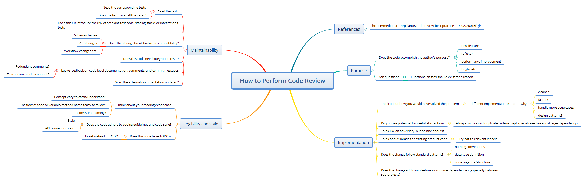

## Why we need code review?
Code reiview is playing an important role in the engieering process. It is the safeguard for the quality of code.

Usually, there are a bunch of benefits for doing code review:
* **Share knowledge**
    * **Tech knowledge sharing**: Both the code reviewer and the author could learn from each other. Reviewer can learn new algorithms, innovative data structure, different implementation ideas etc. Author can learn the tricks or experiences for handling special scenarios, coding styles etc.
    * **Domain knowledge sharing**: Via code review, the reviewers could understand how the code or the system works, and why implement it that way etc. These knowledge is extremely important for the whole team, and different people could be the backup of others.
    * **Learn/Teach about an area**: Code review is also a great approach to lean about an area. In code review, you will try to understand why implement the code like this way, how does different pieces work together. What is more, you could be able to check history of all related code change and understand the evolution history as well.
* **Standand**
    * **Coding style**: Standandize the coding format and principle is a great way to make the code easier to read/understand, and make the whole codebase maintainable.
    * **Personal coding style**: With the strict coding style policy, it could help the author to grow the consistent coding behaviors. And generally it could improve the code quality as well.
* **Quality**
    * **Find bugs**: There are usually errors/bugs caused by the typos or careless and could easily detected via code review.
    * **Design**: The design of the code implementation also could be discussed via code review (please note that if there is a big change/feature, we should have a separate design meeting with the critical people before coding). For example, the design/implement patterns in practices, how to make the code more reusable, how to make the code more extensible and flexible etc.
* **Compliance**
    * **Security** is an important feature in the product. Some of them are made on purpose (like the backdoor, even it is rare). Others usually becuase of the author does not pay a careful attention to or lack of experience and having the security issues in the code. With code review by the senior experts who has a bunch of experiences and could help point out most of the cases. What is more, the specific security team could join review the code and make sure it follow regulatory or security criterias.
    * **Privacy** issues also could be detected via the code review.

## What should code review focus?
There are several perspectives:
* **Context**: Not only the coding itself, but also why coding that way
* [**Stucture errors**](https://medium.com/palantir/code-review-best-practices-19e02780015f)
    * Logic/algorithm bugs
    * Performance issues
    * Architecture concerns
    * Dead code or improper method use
* **Security check list**
* **Coding style**: coding style/contract, properly naming, typos

## How to do code reivew?
Code review could basically have two categories:
* Auto code review
* Manual code review

The auto code review mostly depends on the tools to automatically to detect. There are two kinds of checking:
* The coding style, tools like using FxCop analyzers, Resharper etc. could help detect and fix the coding style issues, also help to fix some bug in some cases.
* Advanced feature, the code review tool learn from the massive code base, history code review records and provide semantic suggestion. This could catch some basic common issues during the code review and might reduce the expert's review effort.

The manual code review is the generally code review. To improve the code review quality and efficiency, we usually leverage both technologies. The auto code review will focus on resolving the coding style, common basic errors while experts focus on more domain specific feedbacks.

In terms of the manual code review, We should follow several principles:
* Ownership of the code should always be the author. Code reviewers are always providing the feedback or suggestions.
* When doing code review, we should always understand the `Context` for the code change.
* Code review comments always about the code not people.

*How to perform code review?*
There are some suggestions as following:
* If you are in the required list, response it as higher priority (comparing those to team level)
* If there is a turn-around policy (say 24 hours), please make sure to follow to unblock others
    * If there is an exception, please let the code author knows
* Start from high level then to the lower level. Like focus on the interface and then the internal details.
* Clear comment the issue's priority
    * Make it clear what level the comment is, or just a nit suggestion
        * Clear bug
        * Potential issue 
        * Performance issue
        * Design perference
        * Style preference
        * ...
* Make the comment description in detail if possible. If you could provide an example, that will be better. Make sure it is actionable.
* If there is a big concern or design problem, talk in person/offline (much more efficient). Or you might have a bunch of comments to make, do the pair code review in person.
* Not challenge the design choices unless you have sufficient reasons. Please always assume that design choices was thoughtful about by the author and you might miss some context about it.
* Provide the specific reason of comment, instead of personal preference. Bad example: `because I don't like it.`
* Don't afraid to ask question, especially for junior engineer.

This [article](https://medium.com/palantir/code-review-best-practices-19e02780015f) from Palantir provides a lot of great suggestion about how to perform the code review.

*How to handle comments?*
If you decide to resolve the issue for that comment later, please explictly explain (and why not resolve it now) and mark it as not resolve (some tools provide the feature) in the current PR.

Always fix those comments that make sense.

## How to prepare a pull request (PR) for code review?

There are several principles for creating code review:
* **Keep code reviews as small as possible**: changes within a code review should be coherent, we should not put several purposes' change into one code review. For example, code refactoring should be one code review instead of having bug fixing/feature changes in the same code reivew.
* **Make sure critical reviewers in required list**: make sure the important people in the review list and be aware of your changes. They are usually the component owners, area/domain experts etc.
* **Title should be clear (what to do), and description has the context info (why/how)**: usually title should be able to describe what you are going to do and the description might describe the detail of why, in what scenarios, what test you did and maybe some metrics. Title should tell what you did, desciption should tell more detail about what to resolve, why you do or how you do. Even, you could apply the practice of adding the type of change in the prefix of the code review which may it more clear. For example, `[bug-fix] Fix the ....`, `[feature] ...`, `[refactoring] ...`.

*Before sending out the code review, what should we do?*
There are some practice suggestions:
* Make sure that your change all pass the tests, style or other CI checking/testing.
* Send our local code review request just to yourself and try to do code review for yourself if possible. Try to review/understand the code review from other's perspective, and keep asking why. Accoding to my experiences, this would help a lot to reduce the comments and iterations.
* If the change is changing service/component interfaces or behaviors, do the mini-review meeting with team and maybe related partner team to go through the plan before any coding.

## Code review tools
There are several reviewing tools: like github online code review, VSTS online code review etc. The characteristics for code review tools:
* Diffing
* Ignore/show white space
* Seperate comments and changes (content)

## Further Readings/References
* https://medium.com/palantir/code-review-best-practices-19e02780015f
* https://blog.fullstory.com/what-we-learned-from-google-code-reviews-arent-just-for-catching-bugs/
