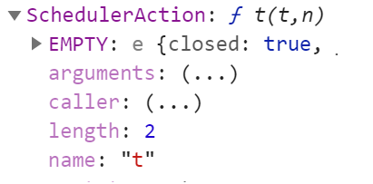
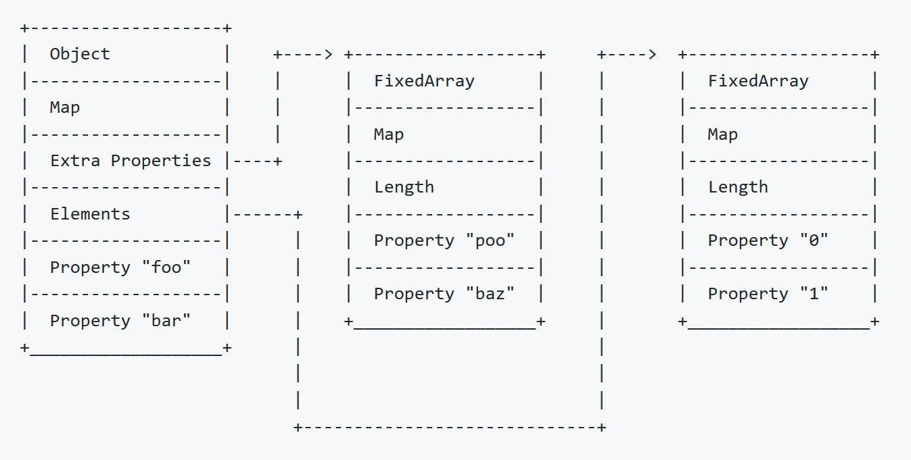
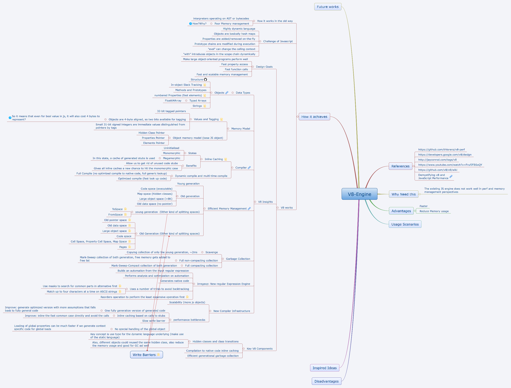

## Why needs the new v8-engine?
Before v8 engine, the existing solutions mostly act as interpreters which operates on AST and bytecodes, as a result the performence of execution is expectedly not very good. What is more, also they doesn't really do a good job on the memory management.

The modern website has a lot more rich features and heavily replies on the javascript. The development complexity is increasing and evolving into larger object-oriented project.

So, it requires a new javascript engine to full fill the new requirements. The new engine should match two main goals:
- Performance
    - Fast property access
    - Fast function call
    - Perform well on large object-oriented design projects
- Memory
    - Fast and scalable memory management

## Challenges
Javascript is a highly dynamic language, the behaviors and objects are mostly determined during the runtime. The objects are basically the hash maps, the properties are stored as the key in the dictionary which could be added/removed on the fly. What is more, Prototype chains in javascript could be changed during execution. The other language features like `with` scope introduces objects in the scope chain dynamically and the `eval` can even change the calling context, etc.

## V8 Insights
### Data Types
**In JavaScript, everything is an object, how the engine support it?**

`Object`: in order to represent the object, V8 use a collection of *properties* (i,e, key-value pair) to represent object. The property in Javascript's object is always a string, so when use othery type of data as the object's property, it will be automatically converted to a string. 

`Array`: a array could represent as an object with a special builtin property *length*. The object within the array is (most, those index one) named after non-negative integer, i.e. index. They value of length is always the largest integer name plus one.

`Functions`: the *length* property returns the number of paramters. 

**How V8 implement to store object?**

Hash tables is good fit to the store JavaScirpt which basically maps from strings to values. V8 also use it to store complicated objects. Strings used as `symbol` to identify the value, and the hash code is calculated only once in lazy way.

However, the hash tables is slow comparing to offset access. How V8 works to improve the performance?

***In-object fast properties***:
    
    The scenario it want to resolve is to reduce the access type for most common objects. 
    
    Why it works? It reduce the property access time for the most often operation and hence improve performance a lot.
    
    How it works? The `maps` concept is used to describe the object's structure. It is a table of descriptors: one entry, one property. What other info maps also store? size of object, pointers to constructors and prototypes etc. To reduce the memory usage, objects with same structure usually share the same map. *Then the next question is, how does the objects be identified and share the same map?*  
    
    What if the property of object changed? `Transitions` is the solution to resolve the problem. Then V8 could reuse existing maps and avoid unnecessary maps creation to reduce the memory cost. If there is no maps able to do transitions, if will copy the existing one to create a new one and add a FIELD for the new property. And also, it will add a TRANSITION descriptor to the previous one which is also the only way to modify to a map (mostly immutable). Please note that, the order of the property matters. All the objects share the same map would have the exact order of properties. There is also the reason some tips for the high performance tips for JavaScript code writing. Actualy, V8 might detect and handle minor cases for the reorder ones. If the objects from same constructor in different order (like having if condition and different order to properties creating), or deleting properties, the object might be fallback to use hash table which is much slower.

The above object structure in v8 is from this [blog](https://github.com/thlorenz/v8-perf/blob/master/data-types.md#objects) which describes a lot of detail info there.

***In-object slack tracking***:
In-object slack tracking is used to determine an appropriate size for instances of each constructor.

Initially, objects allocated by a constructor are given large amount of memory: enough for 32 fast properties stored within the object. After allocating couple objects (like 8) in the same constructor, V8 check the maximum size of the initial object by traversing transition tree from the initial map. Then new object created by the same constructor will be allocated use that amount of memory, and also the initial objects are resized.

What if a new property is added? Handled by allocating an overflow array to store extra properties. And the overflow array can be reallocated with larger size as new properties added.

***Method and Prototypes***
C++ uses the virtual table for handling dynamic functions and reduce the memory cast, V8 uses similar strategy to handle the functions objects/properties: maps. It adds a new descriptor: constant functions. A constant function descriptor refers that the object has a property and the value is stored within descriptor instead of in the object.

`Prototype` is another way in javascript used to share properties. Every constructor has a prototype associated to it. 

***Numbered properties: fast elements***
`Element` stores property with a non-negative integer key. Elements are stored separately from named propertes, in a contiguous array. Each object has one pointer to its elements and the maps use the elements kind to determine how elements are stored. Three kinds:
- Fast small integers
  - 31-bit signed integers
  - If range out of it, upgrade to fast double
- Fast doubles
  - Stored as unboxed representation
- Fast values
  - String or object

If assign value to an index that is way past the range of elements array, V8 downgrade it to dictionary mode.

Arrary can be stored by: fast elements and dictionary elements. Fast elements is contiguous storage buffer and smaller (<64k) while dictionary elements use the hash table storage and is sparse and slow. 

### Memory Model

### V8 Compiler

### Memory Management & Garbage Collection

### New compiler infrastructure

## Map

## References
- http://jayconrod.com/posts/52/a-tour-of-v8-object-representation
- https://github.com/thlorenz/v8-perf
- http://jayconrod.com/tags/v8
- https://github.com/v8/v8/wiki
- [Demystifying v8 and JavaScript Performance](http://thlorenz.com/talks/demystifying-v8/talk.pdf)
- https://developers.google.com/v8/design