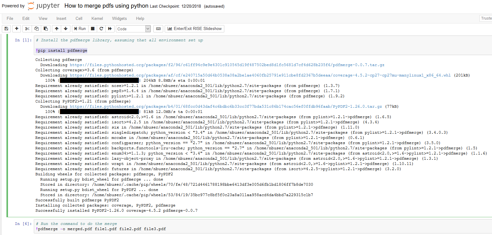

There is a utility library [pdfmerge](https://github.com/metaist/pdfmerge) help to merge, splice and rotate pdf documents. Here I will only introduce how to use that utility to do the pdf merge. Once the environment is setup, you could also do the other operations (or more advanced features) on the pdf document. For more commands please check the [usuage instruction](https://github.com/metaist/pdfmerge).

## Prerequisite
* Dependency
    1. python 2
    2. pip (*used to install pdfmerge*)
    3. pdfmerge library

## 1. Environment set up
You choose any options as below. The first one is the easiest and 'environment free' solution

1. [Azure Notebooks](https://notebooks.azure.com/) (or any jupyter SaaS provider website)

    You could sign up an account and create a project in your notebooks, then your python related environment is ready. Follow steps:

    * Step 1: create notebook with python 2.7
    * Step 2: run command `!pip install pdfmerge` in the jupyter cell, then it will automatically install all related packages.

2. In Anaconda environment
    
    If you already installed Anaconda, you could create a crean environment only used for your pdfs merge.

    1. Use command `conda create -n Python27 python=2.7` to create the environment `Python27` with python 2.7 version
    2. Activate the environment via `activate Python27`
    3. Install the pdfmerge package via `pip install pdfmerge`

 
3. In a raw machine

    If you don't have the Anaconda, please follow the instruction to install the pip package management and python 2.7. Then run the command `pip install pdfmerge` to install the pdfmerge package. 

So far you already have the environment set up.

## 2. Usuage
After setting up the environment, you could run the commands to do what you need.

Example for merge: 
* Command `pdfmerge -o merged.pdf file1.pdf file2.pdf file3.pdf`
    * merged.pdf is the output merged file name
    * file1.pdf, file2.pdf, file3.pdf are the files you want to merge. They will be merged in order

## Example:

